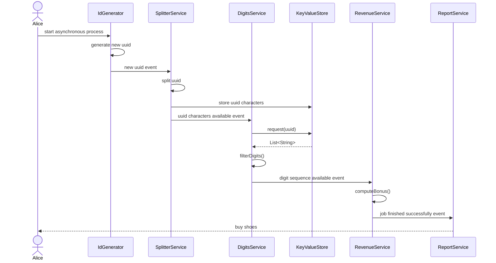

# Reactive Stuff

## Links
- [Unraveling Project Reactor](https://eherrera.net/project-reactor-course/)
- [Project Reactor](https://projectreactor.io/)
- [Reactive Streams](https://www.reactive-streams.org/)
  - [Textual Description](https://github.com/reactive-streams/reactive-streams-jvm/blob/v1.0.4/README.md#specification)
  - [API](https://www.reactive-streams.org/reactive-streams-1.0.4-javadoc/org/reactivestreams/package-summary.html)
- [Intellij Reactive Blog](https://blog.jetbrains.com/idea/2023/06/reactive-programming-made-easy/)

## System with serveral asynchronous services
The challenge is how to connect reactive services with long-running tasks. The option we started
is to interconnect all the services in a single reactive pipeline. As it may work, it has some
serious disadvantages:
- an equivalent to a god class is created - a god pipeline
  - violates single responsibility principle
  - violates open closed principle
- tight coupling
- testing is a nightmare
- error handling gets messy

Due to the nature of the system consisting of asynchronous services, an event driven software architecture
seem to be appropriate. By using a reactive framework, have messaging support is already available. Project
Reactor implements that by Sink's. But implementing a system that way has its own quirks.

Let us implement a playground system to investigate how to implement an event based system with the following in mind:
- **flatMap scenario**: there will be tightly coupled services `A` and `B` where service `B` 'waits' for a value to be produced by service 'A'
- **event scenario**: Services `A` and `B` are independent with `B` waiting for a system state change caused by `A`
- **process outcome**: Needs to be tracked, either in case of success or if any intermediate service fails
- **observabilty**: Influence on monitoring (tracing) when implement it in a modulith way

### The example system requirement(s)
As written by a typical customer, the requiremets are as follows:
- when triggered by Alice the system should compute a new randomly computed reward for Alice the follwing way
  - a UUID will be generated internally
  - a list of characters is generated from the UUID and stored in a key value database
  - as a new UUID characters list is available, the digits are filtered from that list
  - the digits are used to compute the bonus for Alice
  - Alice needs to know immediately when a new bonus is available
- expect the bonus computation to last quite long because a lot of other systems will be queried internally
- all other task will be quite fast but need to run asynchronous anyway
- in future there will be some more requirements like no bonus for low quality UUIDs
- for simplicity assume
  - Alice triggers the system by invoking a UUID generator directly
  - Logging is sufficient for notification of new bonus
  - key value database in memory, just a simple `HashMap` will do

### The example system
As designed by a typical software engineer there will be no documentation other than the code. But at least we sketched
kinda control flow. A sequence diagram seems not to be the best option to describe an event based system. Anyway, it shows
the typical fire and forget control flow for such a system. When triggered by receiving an event (or direct invocation at start),
each service does some work. When finished, it sends an event to anybody interested in.



### How to implement, solutions, problems, questions

#### Testing that an event has been published
Piece of cake:
- use `StepVerifier.create()` on the Flux (Sink) to listen too
- trigger event emitting by subscribing in `.then()` `Runnable`
- expect the event
- cancek the subscription with `thenCancel()`
- and `verify()`

Looks like the following, taken from `SplitterService`
````
StepVerifier.create(splitterService.splitterResult())
                .then(() -> splitterService.processNextId().subscribe())
                .expectNextMatches(p -> p.uuid().equals(THE_UUID))
                .thenCancel()
                .verify();
````

#### How to organize the Sink's
Can't evaluate that on the sample project. Having dependency injection this
might be resolved in a different way. For now, just
- create a Sink in the service emitting values
- use the `Sink.Many.asFlux()` to provide them to the consumer