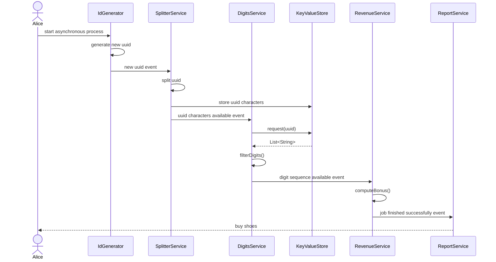

# Reactive Stuff
This project is just a playground to gain experience with reactive systems. The goal is to investigate
reactive software architecture by building a system with simple business logic only. The relevant aspects:
- organization
  - who is responsible for creating the 'event bus'
  - which message types to be used
- testing the system logic

## Motivation / The Problem
A project we work on implements the equivalent to a god class, a god pipeline. Asynchronous services that depend on each
other are organized all in a single reactive pipeline. This has some disadvantages:
- violates single responsibility principle
- violates open closed principle (not extensible easily)
- tight coupling
- testing is a nightmare
- error handling gets messy

## Solution (Idea)
Using Project Reactor, messaging support is already on board. No messaging infrastructure is required.
The magic word is [Sink](https://projectreactor.io/docs/core/release/reference/coreFeatures/sinks.html)

## Concepts / Setting the Stage
We will examine two different couplings of services `A` and `B`.

### Flat Map Scenario
Service `B` needs some data from `A` as a precondition. `B` will remain in the same pipeline with `A`, therefore termed
the 'flat map scenario', though it might be implemented in other ways than using `flatMap()`. The data flows within
the pipeline. Execution of both services is managed by the pipeline.

To be applied when:
- services are tightly coupled at the business level
- `A` is quite a fast service, e.g. fetching the data through a REST API
- `B` is the only service consuming data from `A`

### Event Scenario
Service `B` needs to wait for `A` to transform the whole system state. `A` emits a signal about its progress to anybody
interested - in our case `B` will subscribe to such an event. `A` and `B` don't run in the same pipeline. Data may flow
within the event submitted by `A` or just extracting the data from the system by service `B`.

To be applied when
- services are loosely coupled at the business level
- 'A' is a long-running service, e.g. a batch process
- other services than `B` might be interested in `A` signalling its progress

### The example system requirements
As written by a typical customer, the requiremets are as follows:
- when triggered by Alice the system should compute a new randomly computed reward for Alice the follwing way
  - a UUID will be generated internally
  - a list of characters is generated from the UUID and stored in a key value database
  - as a new UUID characters list is available, the digits are filtered from that list
  - the digits are used to compute the bonus for Alice
  - Alice needs to know immediately when a new bonus is available
- expect the bonus computation to last quite long because a lot of other systems will be queried internally
- all other task will be quite fast but need to run asynchronous anyway
- in future there will be some more requirements like no bonus for low quality UUIDs
- for simplicity assume
  - Alice triggers the system by invoking a UUID generator directly
  - Logging is sufficient for notification of new bonus
  - key value database in memory, just a simple `HashMap` will do

### The example system
As designed by a typical software engineer there will be no documentation other than the code. But at least we sketched
kinda control flow. A sequence diagram might not be the best option to describe an event based system. Anyway, it shows
the fire and forget control flow of such a system. When triggered by receiving an event (or direct invocation at start),
each service does some work. When finished, it sends an event to anybody interested in.



### How to implement, solutions, problems, questions

#### Testing that an event has been published
Piece of cake:
- use `StepVerifier.create()` on the Flux (Sink) to listen too
- trigger event emitting by subscribing in `.then()` `Runnable`
- expect the event
- cancek the subscription with `thenCancel()`
- and `verify()`

Looks like the following, taken from `SplitterService`
````
StepVerifier.create(splitterService.splitterResult())
                .then(() -> splitterService.processNextId().subscribe())
                .expectNextMatches(p -> p.uuid().equals(THE_UUID))
                .thenCancel()
                .verify();
````
#### How to organize the Sink's
Can't evaluate that on the sample project. Having dependency injection this
might be resolved in a different way. For now, just
- create a Sink in the service emitting values
- use the `Sink.Many.asFlux()` to provide them to the consumer

#### Testing a service in the event scenario
Assume the business logic has been tested already. We are interested only in a black box test:
- set up the system into a state the service expects - usually a database
- create a `Sink` and the event to be emitted by that `Sink`
- create the service under test, passing the `Sink` as a (incoming) `Flux`
- emit the event
- subscribe the `StepVerifier` to the service outgoing `Flux`, expect, cancel and verify

#### Testing that a service subscribes to a publisher
Can't be done with the `StepVerifier` - at least I didn't succeed. A working trick is to use the
`doOnSubscribe()` method passing a consumer causing a side effect. Then just assert that one.

#### TODOs
- get a better understanding of `Sink` types and how to use them
- dig into error handling
- investigate deadlocks (is it possible like in the flatMap scenario with buffering schedulers?)